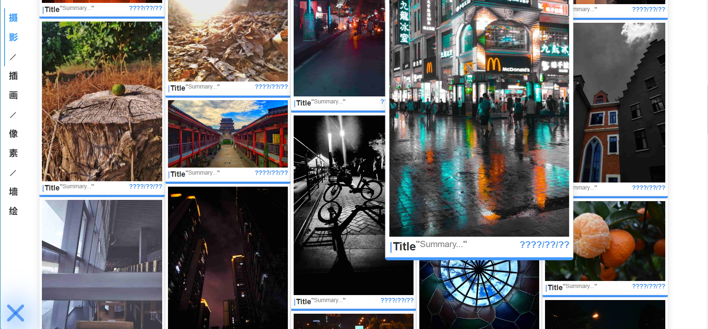

### 界面

### 正在进行的工作
- [X] 制作压缩图片副本，用于展示级
- [ ] 将相册图片缓存进indexedDB，减少服务器请求次数
- [X] 设置应用缓存（application cache） 
- [ ] 使用el骨架屏加载过度
- [ ] 自定义tabs，使用路由方式切换页面
- [ ] 把el部分自己实现并封装组件
- [ ] public图片资源和图片数据迁移到数据库
- [ ] 清理文件
